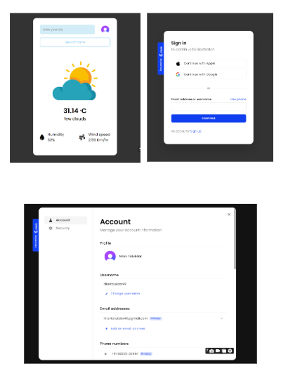

# SkyWatch

 <!-- Add a screenshot of your app here -->

## Description

This Weather App allows users to search for weather information for various cities around the world. Built using HTML, CSS, and vanilla JavaScript, the app integrates with the OpenWeather API to provide up-to-date weather data. User authentication is handled via Clerk CDN, ensuring a secure and seamless experience.

## Features

- **Search Functionality**: Quickly find weather information for any city.
- **Current Weather Data**: Displays temperature, humidity, wind speed, and conditions.
- **User Authentication**: Sign up and log in using Clerk for a personalized experience.
- **Responsive Design**: Works on both desktop and mobile devices.


## Technologies Used

- HTML
- CSS
- JavaScript (Vanilla)
- OpenWeather API
- Clerk CDN for authentication
- Netlify for deployment
- GitHub Pages for deployment

## Installation

To run this project locally, follow these steps:

1. Clone the repository:

   ```bash
   git clone https://github.com/nilav-talukdar/SkyWatch.git
   cd weather-app
